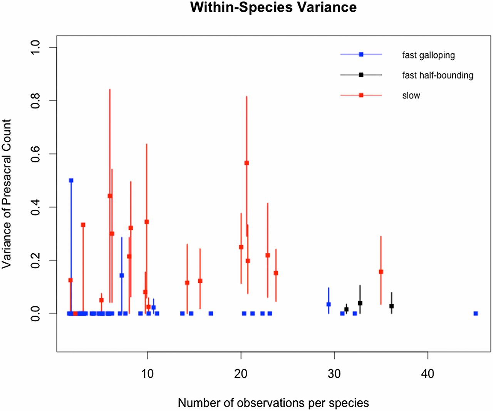

```{r}
knitr::opts_chunk$set(
    echo = TRUE,
    warning = FALSE,
    comment = "##",
    prompt = TRUE,
    tidy = TRUE,
    tidy.opts = list(width.cutoff = 75),
    fig.path = "img/"
)
```

#Galis et al. (2004) - "Fast running restricts evolutionary change of the vetebral column in mammals"
###Galis, F., Carrier, D. R., Van Alphen, J., Van Der Mije, S. D., Van Dooren, T. J., Metz, J. A., & ten Broek, C. M. (2014). Fast running restricts evolutionary change of the vertebral column in mammals. Proceedings of the National Academy of Sciences, 111(31), 11401-11406.
##Data analysis done by Tom J. M. Van Dooren

###Galis et al. investigae the conservation of mammalian presacral vetebrae and examine whether or not there is a correlation between strong conservation and running speed.  Authors hypothesize that biomechanical problems associated with initial homeotic transformations result in the strong conservation of number of presacral vertebrae in fast mammals, moreso than in slow mammals, because quickness and agility would be hampered by incomplete and/or asymmetric fusions of lumbar vertebrae to the sacrum. 
###Methods: To test this hypothesis, authors counted presacral vertebral columns of 802 individuals from 82 species within 5 Families. They then assigned a running classification speed to each species based on references in the literature. The authors then conducted the following statistical analyses based on these counts. Authors analyzed contingency tables of taxa of different speeds and presacral counts using Fisher's exact tests and reported P-values (details below).  Within-species variation of groups according to speed was calculated by bootstrapping 95% confidence intervals of the variance 1000 times.  These results were then depicted in a figure. The authors mention an additional comparison using linear models, but they do not mention this in the paper nor do they depict it, so I did not conduct this analysis.
###Results: The analyses support the hypothesis that developmental and biomechanical constraints limit mammalian presacral vertebrae evolution. Fast mammals had almost no variation in presacral vertebral count. Most significant differences between normal and abnormal presacral counts occur between fast and slow taxa. The taxa with the highest frequency of abnormal vertebrae move slowly and cautiously, supporting the hypothesis that transitional/abnormal vertebrae interfere with quick and agile movements. Most fast species had no intraspecific variation in presacral count, variation is more common in slow groups.

##Data analysis replicated:
* In this assingment I will replicate the Fisher's exact tests and p-value comparisons and the variance bootstrapping with 95%CI.  I also reconstruct Figure 4 of the paper, which is based on the bootstrappin analysis.

```{r}
#Packages used for data analysis
library(curl)
library(dplyr)
library(ggplot2)

#Load in data from Github
f <- curl("https://raw.githubusercontent.com/amc5/Data-Reanalysis-Assignment/master/fastslowmammals.csv")
d <- read.csv(f, header = TRUE, stringsAsFactors = FALSE) #read in data
head(d) #checking data
#d is the original species data set that I received from the author
```

###This first chunk of code is running the Fisher's exact tests on Presacral number both within and between Families.  Fisher's exact tests are used to analyze categorical data within a contingency table (Crawley, 2015, page 104).  The null hypothesis of a Fisher's exact test is independence between variable proportions. In this data analysis, the categorical variables are normal number of presacral vertebrae and abnormal number of presacral vertebrae present in each family.  The null hypothesis is that the number of normal and abnormal vertebrae between taxa speeds are independent of running speed.  Authors use "abnormal" presacral vertebrae to refer to individuals possessing nonmodal frequencies of vertebrae for their taxa, examples show this can be due to an asymmetric transitional lumbosacral vertebra or a missing lumbar vertebra due to sacralization.  Using a Fisher's exact test is relevant to this data analysis because it provides p-values describing whether or not speed designation of taxa is independent of presacral vertebrae.

##My methods for running the Fisher's exact tests:
* Create matrix of contingency table of count of normal vertebrae and abnormal vertebrae of each speed classification (whichever is called for for the specific test)
* Create the matrix by hand for each test because the Excel tables from the supplementary data only provided the raw genera data.  Therefore, the totals of normal and abnormal presacral vertebrae counts had to be tallied and entered by hand in R.
* Run Fisher's exact test using built in R function fisher.test(x)
* I provide the calculated p-value from my test, and then the author's reported p-value, when different, in parentheses next to it

```{r}
#fast galloping vs fast half-bound Carnivora
x <- as.matrix(c(270, 1, 96, 5)) 
dim(x) <- (c(2,2))
fisher.test(x) #p=0.006432, (<0.01)

#fast half-bound vs slow Carnivora
x <- as.matrix(c(96, 5, 38, 13))
dim(x) <- c(2,2)
fisher.test(x) #p=0.00078, (<0.001)

#fast galloping vs slow  Carnivora
x<- as.matrix(c(270, 1, 38, 13)) 
dim(x) <- c(2,2) 
fisher.test(x) #p=1.175e-10, (<0.001)

#fast vs slow Artiodactyla
x <- as.matrix(c(158, 3, 63, 45))
dim(x) <- c(2,2)
fisher.test(x) #p<2.2e-16, (<0.001)

#fast vs slow Bovidae
x <- as.matrix(c(134, 3, 21, 7))
dim(x) <- c(2,2)
fisher.test(x) #p=0.0001686, (<0.001)

#fast vs slow non-Bovidae
x <- as.matrix(c(24, 0, 42, 38))
dim(x) <- c(2,2)
fisher.test(x) #p= 4.164e-06, (<0.001)

#fast Carnivora vs fast Artiodactyla
x<- as.matrix(c(270, 1, 158, 3)) #fast carnivora vs fast artiodactyla
dim(x)<- c(2,2)
fisher.test(x) #pval=0.1481 (0.24)

#slow Carnivora, Artiodactyla, Afrotheria, and Monotremata
x<- as.matrix(c(38, 13, 63, 45, 17, 16, 15, 34)) #this will be the comparison between mulitple taxa (carn,art,mono,afro)
dim(x)<- c(2, 4)
x
fisher.test(x) #p=0.0001289 instead of 0.01
```

###Authors adjusted the p-values of the following comparisons using the Holm-Bonferroni adjustment. These are posthoc tests of the above comparison between four families (Carnivora, Artiodactyla, Afrotheria, and Monotremata).  The purpose of this posthoc comparison is to examine that specific experiment for relationships within the first analysis. A Holm-Bonferoni adjustment was used because adjusts the criteria for rejecting the null hypothesis, making it more difficult to get a Type I error (incorrect rejection of a true null hypothesis).

```{r}
#Posthoc comparison of slow Carnivora vs slow Artiodactyla
x <- as.matrix(c(38,  13, 68, 45))
dim(x) <- c(2,2)
y<-fisher.test(x)
p.adjust(y$p.value, method = "holm", n=6) #p=0.4858546, (0.4)

#posthoc comparison of slow Carnivora vs Monotremata
x <- as.matrix(c(38, 13, 17, 16))
dim(x) <- c(2,2)
y <- fisher.test(x)
p.adjust(y$p.value, method = "holm", n=6) #p=0.2208835, (0.21)

#posthoc comarison of Carnivora vs Afrotheria
x <- as.matrix(c(38, 13, 15, 34))
dim(x) <- c(2,2)
y <- fisher.test(x)
p.adjust(y$p.value, method = "holm", n=6) #p=0.0001, (<0.001)

#posthoc comparison of Artiodactyla vs Afrotheria
x <- as.matrix(c(68, 45, 15, 34))
dim(x) <- c(2,2)
y<-fisher.test(x)
p.adjust(y$p.value, method = "holm", n=6) #p=0.00372, (<0.05)

#posthoc comparison of Artiodactyla vs Monotremata
x <- as.matrix(c(63, 45, 17, 16))
dim(x) <- c(2,2)
y<-fisher.test(x)
p.adjust(y$p.value, method = "holm", n=6) #p=1, (0.60)

#posthoc comparison of Monotremata vs Afrotheria
x <- as.matrix(c(17, 16, 15, 34))
dim(x) <- c(2,2)
y<-fisher.test(x)
p.adjust(y$p.value, method = "holm", n=6) #p=0.408, (0.54)
```

###The authors reported six p-values as insignificant.  I calculated different p-values for each of these six insignificant, reported values.  My calculations result in the same p-values as being significant that they report.  I reached out to the first author, Galis, about the discrepancy between our results.  She did not comment on the p-values, but she did respond that the authors are continuing to accumulate more data and work with their data set. She did not offer any information that helped me understand why our values might be different.
###The results of this test reveal if the differences between speeds of taxa are significant for frequency of abnormal presacral counts and/or the presence of presacral transitional vertebrae.

#Working with species specific data for within-species variance comparison and bootstrapping

```{r} 
#manipulate raw data to get rid of NAs in Presacral count column
summary(d$Presacral.No.) #identifies how many rows contain NA for presacral count
d[is.na(d$Presacral.No.),] #prints rows with NA for presacral count
d <- d[!is.na(d$Presacral.No.),] #removes NA presacral count rows from data
summary(d$Presacral.No.)
head(d)
```

#Create functions for variance and confidence interval bootstrapping (related to figure 4)

###Below I create a mega function that I have heavily annotated to explain my step-by-step process

```{r}
whole_thing <- function(df, n){ #this function will act on the specified dataframe (will be d), n times (will be 1000)
  CI5 <- c() #creates empty vector for 5% CI that will get filled in at bottom of function depending on the results of the function
  CI95 <- c() #creates empty vector for 95% CI that will get filled in at bottom of function depending on the results of the function
  var <- c() #creates empty vector for variance that will get filled in at bottom of function depending on results of the function
  number <- c() #creates empty vector for number of observations that will get filled in at bottom of function depending on the species analyzed
  speed <- c() #creates empty vector for speed classification (slow, half, or fast depending on author's designation in original dataframe) that will get filled in at bottom of function depending on the species
  species <- unique(df$Species) #creates vector containing each species name one time that will be used to split data later
  for(k in 1:length(species)){ 
    v <- NULL #Nulls out variable v each time the function is run for a different species
    s <- NULL #Nulls out variable s each time the function is run for a different species
    singleSpdat <- df%>%filter(Species == species[k]) #this creates a mini data frame made up of the individual species being anaylyzed at a time that only contains the data on one species at a time. The use of piping here allows me to list what I want done in an intuitive manner
    speed[k] <- singleSpdat$Running_Speed[1] #this pulls the speed for each species and adds it to the speed vector created above that will get built in to the new data frame at the end.  This tells it to pull the first speed value from each species
    number[k] <- nrow(singleSpdat) #this pulls the number of rows for each species within the singleSdat, which is only made up of the species being analyzed at the time
    for(i in 1:n){
         s <-sample(singleSpdat$Presacral.No., nrow(singleSpdat), replace = TRUE) #creates variable for the random sampling of each species' presacral vertebrae data, it samples from the number of observances for each species, with replacement so that each value is put back in the bin for each sampling event 
         v[i] <- sum((s - mean(s, na.rm=T))^2)/(length(s) - 1) #equation to calculate the variance of the random sampling of each species' presacral vertebral column count
    }
    var[k] <- mean(v) #creates a single variance for each species based on the mean of the sample of variances
    q <- quantile(v, c(0.25, 0.975), na.rm=TRUE) #creates 95% confidence intervals for each variance
    CI5[k] <- q[1] #creates a column out of the first value in q (which is the 5% CI)
    CI95[k] <- q[2] #creates a column out of the first value in q (which is the 95% CI)
  }
return(data.frame(species, var, CI95, CI5, number, speed)) #tells the function to return a new dataframe with the species, variance, CIs, number of observations, and speed of each species the function is run on
}
finish <- whole_thing(d,1000) #telsl the function to run on the original ddataframe from the authors, 1000 times
View(finish) #allows me to see the new dataframe in a different window
```
#### I REALLY understand functions now!! :) 
###So:
#### I started by doing the slow process of running a function that I had created that calculated the variance and confidence intervals of each vector that I ran through it. I then ran each vector (a vector of presacral counts for each species) through this function one at a time. However, everytime that I did this, the variance was changing a lot for each species (up to 0.2) each time the same vector was run through the same function.  After running the function individually for each species, I created a figure by individually binding each column that I needed to create a dataframe. After accepting the realization that my numbers were wrong, I scrapped it and slowly built the above function. This did not make sense so I started from scratch again.

###The above function "whole_thing" is based directly on my previous function for variance and confidence intervals. I used the same commands and equations to get the variance and confidence intervals and for the random sampling. What I changed is where the data is pulled from (now from the author's data frame instead of from handmade individual vectors). What the function returns is also very different. It now returns a dataframe of all of the information that I need to create my graph in a new data frame. Before I had it returning individual vectors that I then used cbind to create a new data frame.
* It is very satisfying to be able to create one single function for everything that I need to do.
* It is much easier now that I took the time to understand the use and process of function building to create one command that runs my entire data set, rather than created over 100 lines of code that do not return the correct inforamtion.
* My figure now matches the original figure from the publication more closely, although there are a few discrepancies.

##Figure 4 Reconstruction

```{r}
#I use ggplot to construct a graph comparing within species variance with number of observation per species, and then identifying the species based on running speed classification

figure4 <- ggplot(data = finish, aes(x=number, y=var, color=speed)) + geom_point() + scale_color_manual(name = c("slow", "fast-half bound", "fast"), values = c("blue", "black", "red")) + geom_pointrange(aes(ymin=CI5, ymax=CI95)) +  ggtitle("Figure 4: Within-Species Variance") + xlab("Number of observations per species") + ylab("Variance of presacral count (with 95%CI)") + scale_y_continuous(breaks=c(0.0, 0.2, 0.4, 0.6, 0.8, 1.0))
figure4 #command to recreate the figure from the paper
#14 removed because they have NA for var and CI cuz 1 observation
```

###Original Figure 4 from article
 

 
###My Figure 4 looks slightly different from that published in the paper for a few reasons:
* The scale of my y-axis is a little bit different (ending at 0.8 instead of 1.0) because I wanted to focus in a little bit, since none of my confidence intervals exceed 0.8 (unlike the author's).
* Bootstrapping confidence intervals of the mean of variances can provide slightly different numbers because it is randomly sampling 1000 times, a little bit of variation can be expected.
* It appears that we have differences in the number of observances for a few species. I think that this is because I removed the rows with NAs in the presacral count column from my dataset. I think the authors kept these rows for the purpose of the count of observances, but did not use their information for the analysis of variances and confidence intervals. The counts are only off by 1, it appears.
* My figure removed 14 species from the analysis because there was only one individual observed for that species. Therefore the variance and CIs returned for that individual were NA.

##Having evaluated this paper and reconstructed their data analysis, I would not have used the same statistical methods as the authors for the following reasons:
* Upon contacting the first author of this paper, she immediately expressed regrets that she had about the data in the publication, this makes me question the validity of their data set and their data analysis
* Galis et al. state that body size is less of a factor compared to stiffness, though they do not test for this, nor hold it constant. They simply state that there is no difference in big vs small and use elephants in comparison to mouse deer as an example.  What about between animals that are similar in size but run at different speeds (eg: Canis and Procyon)?
* I find it strange that they merely mention an additional statistical analysis in the methods, but never refer to it anywhere else in the paper or mention its results
* In the information I received from the author, they ran a comparison of speed based on phylogeny. However, they do not mention this in the paper either, nor do they say where they got the data for that analysis.


###References:
* Crawley, M. J. (2014). Statistics: An Introduction Using R (Second Edition). Chichester, UK: John Wiley & Sons, Inc.